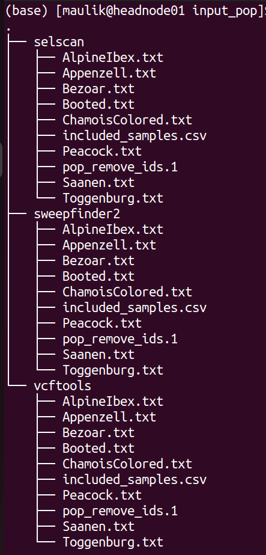
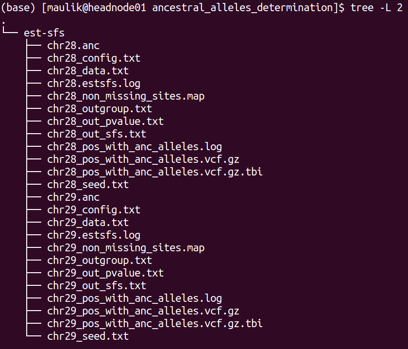

## scalepopgen: signatures of selection
This sub-workflow is intended for genome-wide detection of signatures of selection based on phased and unphased data. It can be enabled with the argument: ``` --sig_sel = true``` . It has following methods : 
 - pairwise Wright's fixation index (Fst) as implemented in vcftools (v 0.1.16)
 - Tajima's D as implemented in vcftools (v 0.1.16)
 - nucleotide diversity (pi) as implemented in vcftools (v 0.1.16)
 - composite likelihood ratio (CLR) as implemented in sweepfinder2 (v 1.0) 
 - integrated haplotype score (iHS) as implemented in selscan (v 1.2.0a)
 - cross-population extended haplotype homozygosity (XP-EHH) as implemented in selscan (v 1.2.0a)
 
## Description of the options and parameters:
Following options require boolean parameter as an input, meaning, either "true" or "false";  the ***default*** is ***false*** . 

```--sig_sel``` : setting this to "false" will not run this entire workflow. 
```--skip_sel_outgroup```: an option to skip the outgroup when applying  signatures of selection.
```--tajima_d```:  whether or not to calculate tajima's D. 
```--pi```: whether or not to calculate nucleotide diversity measure, pi. 
 ```--pairwise_fst```: whether or not to calculate pairwise fst in windows or for each SNPs for every possible pair of population. 
 ```--single_vs_all_fst``` : if this option is set to true, then the workflow will take one population each as one member of the pair and the remaining samples in the dataset as another member of the pair to calculate pairwise fst.
 ```--skip_chrmwise```: an option relevant only for the methods implemented in vcftools; setting this to true will calculate Fst, tajima's D and pi each for each population after concatenating all chromosome-wise vcf files into one genome-wide vcf file per population. 
 ```--clr```:  whether or not to calculate CLR.
 ```--use_precomputed_afs```:  selective sweeps with pre-computed empirical spectrum, option "-l" in SweepFinder2.
 ```--skip_phasing```: setting this to false will skip phasing the data for the analyses with selscan, meaning that the workflow assumed that the vcf files supplied are already phased. 
```--impute_status```: an option to impute the missing genotypes (the reference vcf file need to be provided for that), option "impute" in Beagle.
  ```--ihs```:  whether or not to calculate iHS.
  ```--xpehh``` : whether or not to calculate XP-EHH. 

Following options require file path or string as an input; the ***default*** is ***none*** . 

```--skip_pop```: the path to the text file containing population IDs that will be skipped from all the analyses implemented in this sub-workflow. 
``--ref_vcf``:  the path to the csv file having these two columns: chromosome id and the path to its respective reference file in vcf format which is to be used for imputation and phasing, this ioption "ref" in Beagle. For reference, refer to this example file. 
``--anc_files``: in case of sweepfinder2 or selscan, including the information about acestral and derived allele increases power of the analyses, by invoking this option it is possible to include this information. It  takes any of these three parameters: (i) "create": supplying this string as parameter will invoke the process (described in the next section) of detecting ancestral alleles using the outgroup samples present in the vcf files, (ii). "none": supplying this string as parameter will perform selscan and sweepfinder2 analyses without considering information about ancestral alleles, (iii). if none of the "create" or "none" is supplied, then the parameter is assumed to be the path to the csv file having these two columns: chromosome id and the path to its respective space separated file containing information about ancestral alleles. For reference, refer to these examples files: 
```--ihs_args```: [optional parameters](https://github.com/szpiech/selscan/blob/master/manual/selscan-manual.pdf) that can be applied to iHS computation. 
```--xpehh_args``` : [optional parameters](https://github.com/szpiech/selscan/blob/master/manual/selscan-manual.pdf) that can be applied to XP-EHH computation.
```--selscan_map```: By invoking this option, it is possible to include recombination map information in sweepfinder2 analysis. It takes any of these three parameters: (i). path to the csv file having these two columns: chromosome id and the path to its respective recombination map, (ii), "default": create map file with genetic and physical positions for each variant site using default conversion (1 cm = 1 Mbp), (iii). "none" : supplying this will not consider information about recombination map in sweepfinder2 analyses. 
```--cm_map```:  an option to provide  a path to the csv file having these two columns: chromosome id and the path to its respective PLINK format genetic map with cM units, option "map" in Beagle. 
```--use_recomb_map```: selective sweeps with pre-computed empirical spectrum and recombination map, option "-lr" in SweepFinder2. This argument takes any of these three options: (i) if set to "default", the workflow will create a recombination rate input file assuming 1cm = 1mbp, (ii). if set to "none", the Sweepfinder2 analysis will be run without recombination map file. (iii), if it is neither "default" nor "none", then the path to the csv file having these two columns must be provide: chromosome_id,  and the path to its respective recombination map file in the format as recognized by sweepfinder2. 

Following arguments require integer as an input. 

```--min_samples_per_pop```: minimum sample size of the population to be used in the analyses. Default: 2
```--tajimasd_window_size```: the desired window size for Tajima's D calculation. Default: 50000
```--fst_window_size```: the desired window size for pairwise Fst calculation. Default: 50000
```--fst_step_size```: the desired step size between windows for Fst calculation. Default: -9. Any value of greater than or equal to zero assume that window size and step size are equal. 
```--pi_window_size```: the desired window size for pi calculation. Default: 50000. 
```--pi_step_size```: the desired step size between windows for pi calculation. Default: -9. Any value of greater than or equal to zero assume that window size and step size are equal. 
```--grid_space```: the spacing in number of nucleotides between grid points, option "g" in SweepFinder2. Default: 50000
```--grid_points```: the number of points equally spaced across the genome, option "G" in SweepFinder2. Default: -9. Any value greater than zero will carry out Sweepfinder2 analyses with ```--grid points``` and ignore the value specified in ```--grid space```. 
```--burnin_val```: the maximum number of burnin iterations, option "burnin" in Beagle. Default: 3
```--iterations_val```: the number of iterations, option "iterations=" in Beagle. Default: 12
```--ne_val```: the effective population size, option "ne" in Beagle. Default: 10000000

## Overview of the processed carried out in this sub-workflow: 
Computing iHS and XP-EHH requires phased input data while calculation of Fst, Tajima's D, pi and CLR don't. Following is the brief summary of the processes carried out by this sub-workflow:
**1.** splitting individual's IDs by population into each separate file according to information provided in sample map file and remove the populations that don't satisfy the threshold of minimum sample size. 

**Using vcftools to calculate Tajima's D, Weir's Fst and pi**
**2.** calculating Tajima's D with VCFtools.
**3.** calculating pi with VCFtools
**4.** calculating Fst for each population pair combinations with VCFtools
**5.** calculating Fst for pair combinations of population versus all other with VCFtools

**Detection of ancestral alleles using [est-sfs](https://academic.oup.com/genetics/article/209/3/897/5930981?login=false)**
Analyses implemented in vcftools does not require outgroup/ancestral alleles. In case of CLR as implemented in [Sweepfinder2](http://degiorgiogroup.fau.edu/Manual_SweepFinder2_v1.0.pdf) as well as in case of iHS and XP-EHH as implemented in selscan, using the information of ancestral allele vs derived allele increases the power. Therefore, if the outgroup is present in the vcf files, the following processes are carried out before applying sweepfinder2 and iHS analyses: 

**6.** if the outgroup samples are present in the vcf file, ancestral alleles will be detected using [est-sfs](https://academic.oup.com/genetics/article/209/3/897/5930981?login=false). Note that est-sfs detect ancestral alleles only for those sites where all samples are genotyped (not a single sample has genotypes missing at the position). 
**7.** create a new vcf file by extracting the sites for which "est-sfs" have detected ancestral alleles.  

**Using sweepfinder2 to calculate CLR**
**8.** preparing input files for SweepFinder2: splitting sample map (the same as in step 1)\
**9.** preparing input files for SweepFinder2: genome wide allele frequency and recombination files with in-house Python script\
**10.** computing the empirical frequency spectrum with SweepFinder2\
**11.** calculating CLR with SweepFinder2\

There are several ways of running sweepfinder2 analysis: (i) to run without recombination map or without pre-computing empirical frequency spectrum (section 5.1 of sweepfinder2 manual), provide parameter "none" to ```--use_recomb_map``` and set ```--use_precompute_afs```to false, (ii). to run without recombination map but with pre-computing empirical frequency spectrum (section 5.2 of the sweepfinder2 manual), provide parameter "none" to ```--use_recomb_map```but set ```--use_precompute_afs```to true, (iii). to run with recombination map and with pre-computing empirical frequency spectrum both (section 5.3 of sweepfinder2 manual), either provide "default" or file path to ```--use_recomb_map```and set ```--use_precompute_afs```to true. 

**Using selscan to calculate iHS and XP-EHH**
**12.** preparing input files for selscan: phasing genotypes with the program Beagle\
**13.** preparing input files for selscan: preparing a map file specifying physical distances for the program selscan\
**14.** preparing input files for selscan: splitting the phased VCF files by each population\
**15.** calculating iHS with selscan\
**16.** calculating XP-EHH for each population pair with selscan

## Description of the output files and directory-structure generated by this sub-workflow:

If the pipeline has completed successfully, results of it will be stored in **${output directory}/selection/**. Inside this directory, following directories will be created (depending on the parameters set):


The directory structure of "input_pop" is shown below:

Each directory contains the list of population and samples included in the respective analysis. 

The directory structure of "vcftools" is shown below:

There will be one directory for each analysis performed. The screenshot above shows the directory for "tajima_d" which stores the results of "tajima's d" analysis. Inside that directory, there will be a directory for each chromosome. Inside this directory, there will be results for each population. Likewise, if the option ``--pi`` is set to true, there will be another directory for "pi" besides "tajima_d". 

The directory structure of "ancestral_alleles_determination" is shown below:

There will be 12 files for each chromosome, of these six files are inputs and outputs of "ests-sfs" tool:
1). *_config.txt : the configuration file containing parameters to run est-sfs
2). *_data.txt : the data file
3). *_seed.txt: the text file containing positive integer value
4). *_out_sfs.txt: the output file containing estimated uSFS vector. 
5). *_out_pvalue.txt: the output file containing the estimated ancestral state probabilities for each site. 
6). *_estsfs.log: the log file of est-sfs. 

For detailed description of these files, refer to the manual of [est-sfs ](https://sourceforge.net/projects/est-usfs/). 

The description of remaining six files are as follows:
7). *_non_missing_sites.map: this text file contains three columns: chromsome id, position, and the information about the major allele. If the major allele is reference base then then code in the third column will be 0 else it will be 1 (the major allele is alternative allele). 
8). *_outgroup.txt: information about population used as outgroup
9). *.anc: the text file containing information about ancestral alleles. This text file will be used in the processes of selscan and sweepfinder2 analyses. It contains four columns: chromosome id, position, ancestral allele, derived allele.  0 refers to the reference allele and 1 refers to the alternative allele. 
10). *_pos_with_anc_alleles.vcf.gz: This vcf file contains only those positons where ancestral and derived alleles were determined. It will also be used for sweepfinder2 and selscan analyses. 
11). *_pos_with_anc_alleles.vcf.gz.tbi: Index file of the file mentioned above
12). *_pos_with_anc_alleles.log: the log file containing the command used to generate file 10) and 11). 

The directory structure of "sweepfinder2" is shown below:


It contains two directories: "input_files" and "results". Inside the "input_files" directory, there will be input files used to run sweepfinder2 analysis.  Inside the "results" directory, there will be a directory for each chromosome. Inside this directory, there will be results for each population. 

The directory structure of "selscan" is shown below:


There will be one directory for each analysis performed. In the toy example, only "iHS" analysis was run. Inside "iHS" directories, there will be two more directories:  "input_files" and "results". Inside the "input_files" directory, there will be input files used to run iHS analysis for each population for each chromosome. Within the results directories, there will be one directory each for each chromosome. Inside this directory, there will be two files each population: 
1). *vcf.iHS.out : this is the raw output file generated by selscan. This output is not normalized. 
2). *vcf_anc.iHS.out : this is the output file using the information of ancestral allele. This output is also not normalized. 


## FOLLOWING SECTIONS NEEDS TO BE UPDATED 
## Validation of the sub-workflow:
For workflow validation, we have downloaded publicly available samples (see map below) with whole genome sequences from NCBI database (Alberto et al., 2018; Grossen et al., 2020; Henkel et al., 2019). We included domestic goats (*Capra hircus*) represented by various breeds from Switzerland. In addition to them, we also included Alpine ibex (*C. ibex*) and Bezoar wild goat (*C. aegagrus*). Since we need an outgroup when performing some of the analyses, we also added Urial sheep (*Ovis vignei*). We will use variants from chromosome 28 and 29 of, all together, 85 animals.

		!Here will be the Geographic map picture!
Geographic map of samples used for this trial

 <font size="2">Alberto et al. (2018). Convergent genomic signatures of domestication in sheep and goats. *Nature communications*, https://doi.org/10.1038/s41467-018-03206-y \
Grossen et al. (2020). Purging of highly deleterious mutations through severe bottlenecks in Alpine ibex. *Nature communications*, https://doi.org/10.1038/s41467-020-14803-1 \
Henkel et al. (2019). Selection signatures in goats reveal copy number variants underlying breed-defining coat color phenotypes. *PLoS genetics*, https://doi.org/10.1371/journal.pgen.1008536
 </font>
### 1. Required input data files
The input data should be in the **VCF** or **PLINK binary** format files. 

All VCF files need to be splitted by the chromosomes and indexed with tabix. You will have to prepare csv list of those files, please check *test_input_vcf.csv*. Each row is corresponding to one chromosome and has three different information separated by the comma. Like in example below, the first information in each row is chromosome name, next is path/to/the/file.vcf.gz and the last is path/to/the/file.vcf.gz.tbi.  
```
chr28,https://data.cyverse.org/dav-anon/iplant/home/maulik88/28_filt_samples.vcf.gz,https://data.cyverse.org/dav-anon/iplant/home/maulik88/28_filt_samples.vcf.gz.tbi
chr29,https://data.cyverse.org/dav-anon/iplant/home/maulik88/29_filt_samples.vcf.gz,https://data.cyverse.org/dav-anon/iplant/home/maulik88/29_filt_samples.vcf.gz.tbi
```
In addition to the VCF input format, it is also necessary to prepare a sample map file of individuals and populations. Sample map has two tab-delimited columns: in the first column are individual IDs and in the second are population IDs as demonstrated on the example below. It is also important that the name of the file ends with ".map".
```
SRR8437780ibex	AlpineIbex
SRR8437782ibex	AlpineIbex
SRR8437783ibex	AlpineIbex
SRR8437791ibex	AlpineIbex
SRR8437793ibex	AlpineIbex
SRR8437799ibex	AlpineIbex
SRR8437809ibex	AlpineIbex
SRR8437810ibex	AlpineIbex
SRR8437811ibex	AlpineIbex
SRX5250055_SRR8442974	Appenzell
SRX5250057_SRR8442972	Appenzell
SRX5250124_SRR8442905	Appenzell
SRX5250148_SRR8442881	Appenzell
SRX5250150_SRR8442879	Appenzell
SRX5250151_SRR8442878	Appenzell
SRX5250153_SRR8442876	Appenzell
SRX5250155_SRR8442874	Appenzell
SRX5250156_SRR8442873	Appenzell
SRX5250157_SRR8442872	Appenzell
340330_T1	Bezoar
340331_T1	Bezoar
340334_T1	Bezoar
340340_T1	Bezoar
340345_T1	Bezoar
340347_T1	Bezoar
340426_T1	Bezoar
470100_T1	Bezoar
470104_T1	Bezoar
470106_T1	Bezoar
...
454948_T1	Urial
ERR454947urial	Urial
SRR12396950urial	Urial
```
For the Plink binary input, user need to specify the path to the BED/BIM/FAM files in the section of general parameters:
```input= "path/to/the/files/*.{bed,bim,fam}"```
### 2. Optional input data files


### 3. Setting the parameters
In the parameter file */parameters/scale_popgen.config is a part dedicated to the signatures of selection analyses. 

**// signatures of selection parameters**

    sig_sel                = [bool]
    tajima_d               = [bool]
    pi                     = [bool]
    pairwise_fst           = [bool]
    fst_nj_tree            = [bool]
    single_vs_all_fst      = [bool]
    skip_chrmwise          = [bool]
    skip_phasing           = [bool]
    skip_pop               = ["str"]
    skip_sel_outgroup      = [bool]
    min_samples_per_pop    = [int]
    tajimasd_window_size   = [int]
    fst_window_size        = [int]
    fst_step_size          = [int]
    pi_window_size         = [int]
    pi_step_size           = [int]
    
    clr                    = [bool]
    anc_files              = ["str"]
    grid_space             = [int]
    grid_points            = [int]
    use_precomputed_afs    = ["str"]
    use_recomb_map         = ["str"]
    
    ihs                    = [bool]
    xpehh                  = [bool]
    selscan_map            = ["str"]
    ihs_args               = ["str"]
    xpehh_args             = ["str"]
   
**// beagle phasing parameters**

    ref_vcf            = ["str"]
    cm_map             = ["str"]
    burnin_val         = [int]
    iterations_val     = [int]
    impute_status      = [bool]
    ne_val             = [int]

## References
Please cite the following papers if you use this sub-workflow in your study:

[1] Danecek, P., Auton, A., Abecasis, G., Albers, C. A., Banks, E., DePristo, M. A., Handsaker, R. E., Lunter, G., Marth, G. T., Sherry, S. T., McVean, G., Durbin, R., & 1000 Genomes Project Analysis Group (2011). The variant call format and VCFtools. _Bioinformatics (Oxford, England)_, _27_(15), 2156–2158. https://doi.org/10.1093/bioinformatics/btr330

[2] Keightley, P. D., & Jackson, B. C. (2018). Inferring the Probability of the Derived vs. the Ancestral Allelic State at a Polymorphic Site. _Genetics_, 209(3), 897–906. https://doi.org/10.1534/genetics.118.301120

[3] DeGiorgio, M., Huber, C. D., Hubisz, M. J., Hellmann, I., & Nielsen, R. (2016). SweepFinder2: increased sensitivity, robustness and flexibility. _Bioinformatics (Oxford, England)_, 32(12), 1895–1897. https://doi.org/10.1093/bioinformatics/btw051

[4] Browning, B. L., Tian, X., Zhou, Y., & Browning, S. R. (2021). Fast two-stage phasing of large-scale sequence data. _American journal of human genetics_, 108(10), 1880–1890. https://doi.org/10.1016/j.ajhg.2021.08

[5] Szpiech, Z. A., & Hernandez, R. D. (2014). selscan: an efficient multithreaded program to perform EHH-based scans for positive selection. _Molecular biology and evolution_, 31(10), 2824–2827. https://doi.org/10.1093/molbev/msu211

[6] Di Tommaso, P., Chatzou, M., Floden, E. W., Barja, P. P., Palumbo, E., & Notredame, C. (2017). Nextflow enables reproducible computational workflows. _Nature biotechnology_, 35(4), 316–319. https://doi.org/10.1038/nbt.3820


## License

MIT

   

